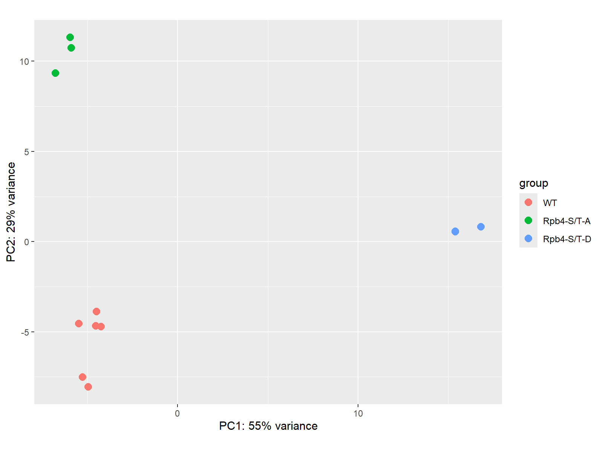
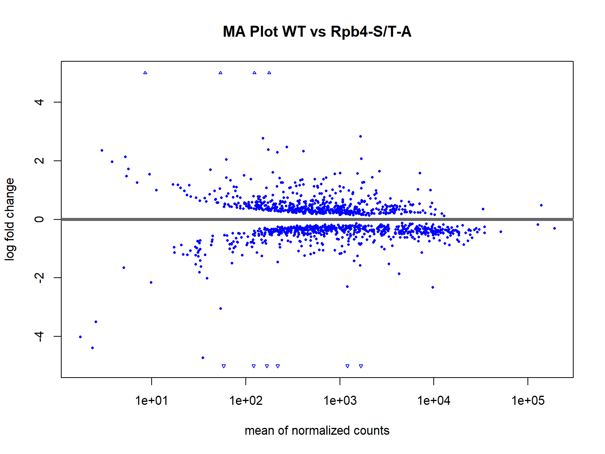
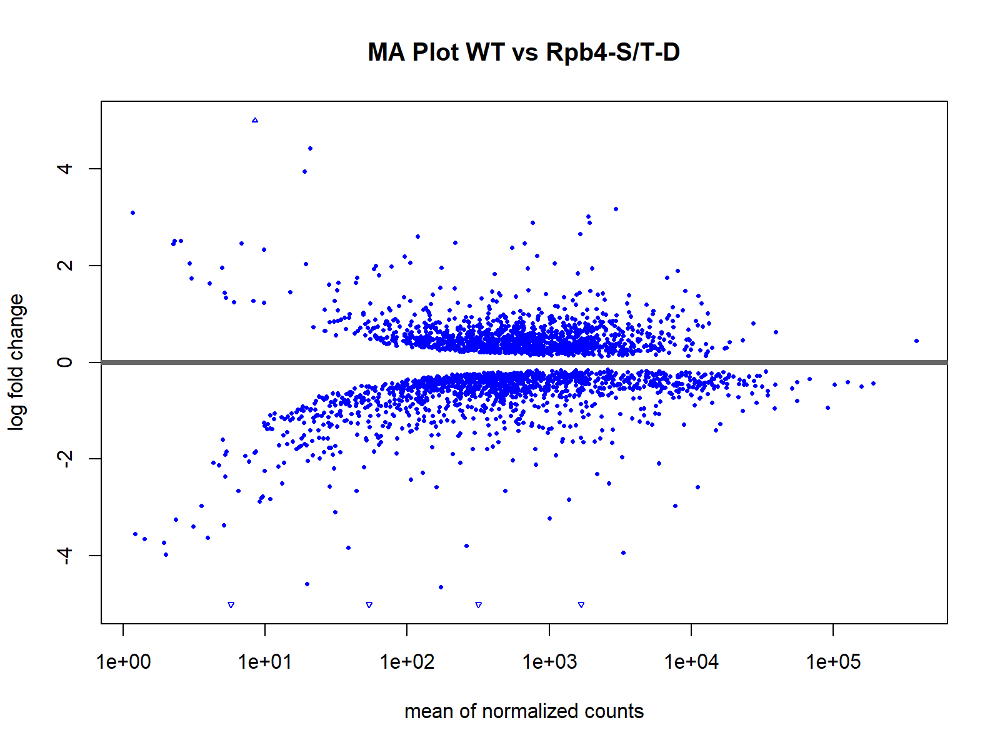
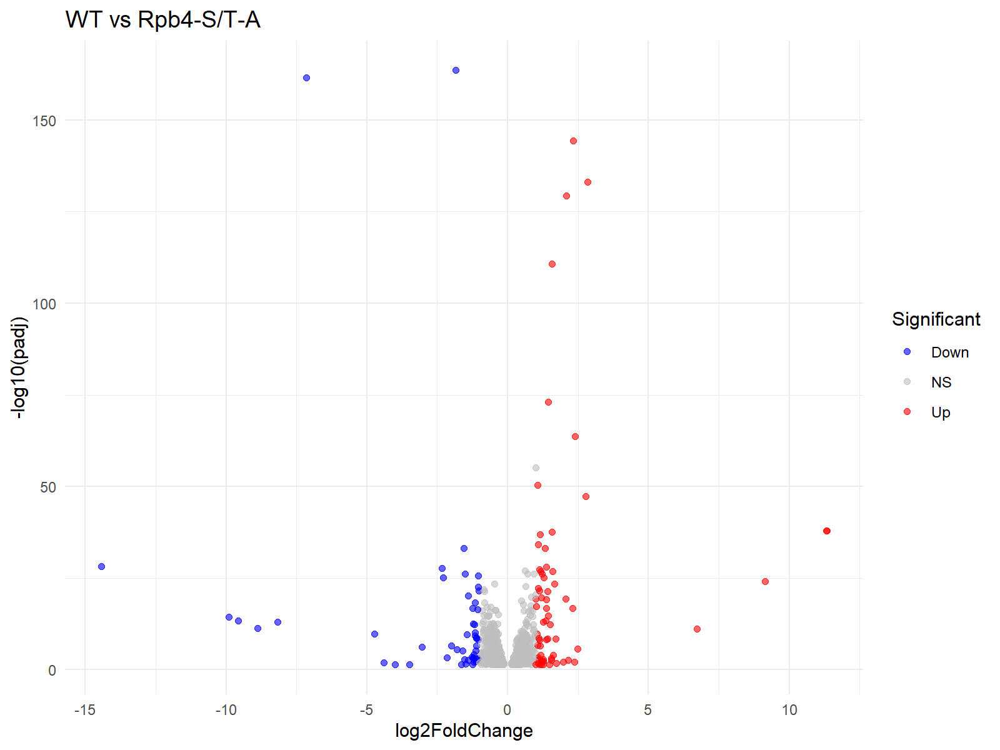
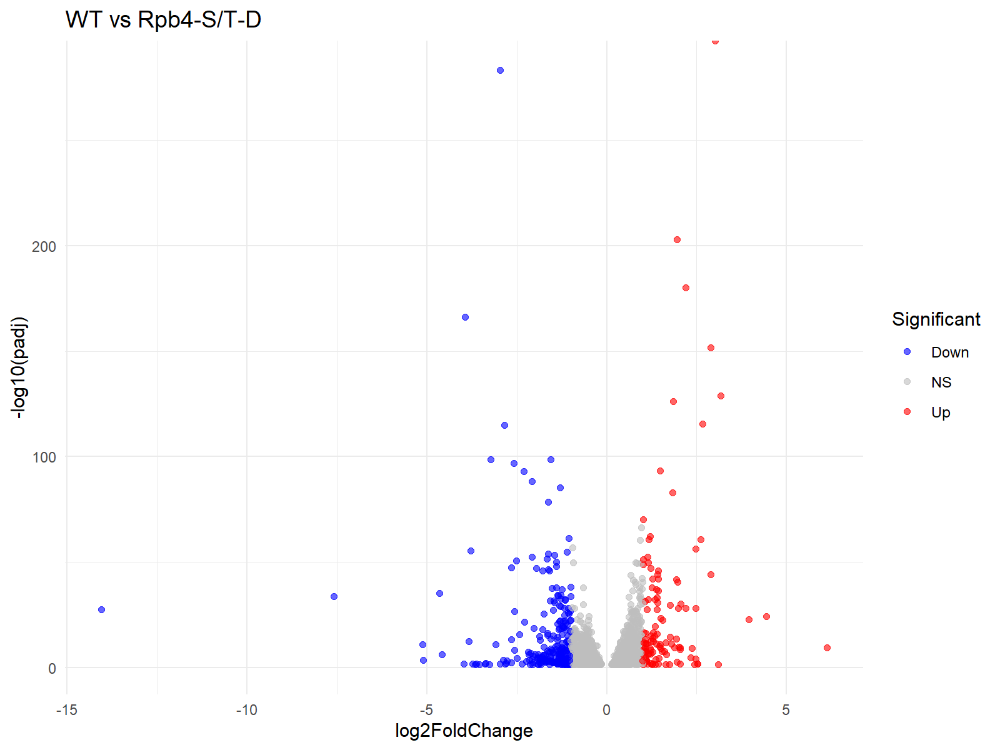
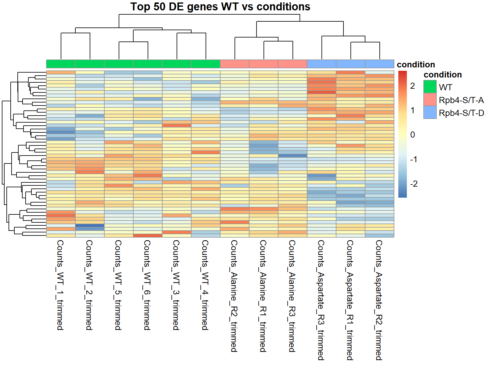
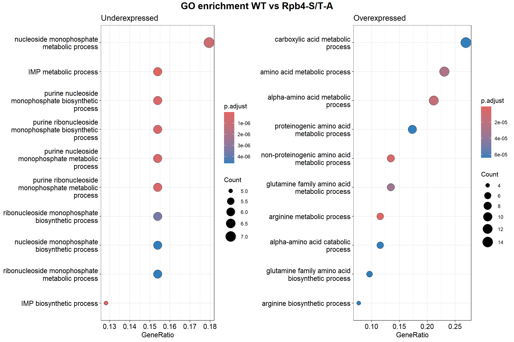
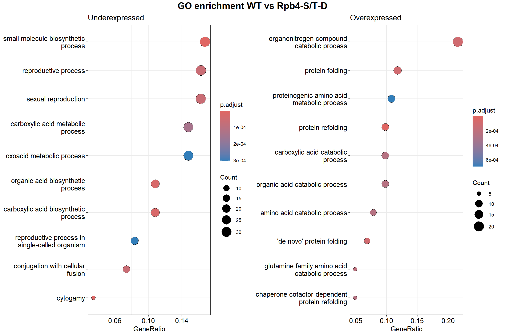

# RNA-seq-Analysis

## Project overview
<p align="justify">
This repository contains a complete RNA-seq analysis pipeline applied to Saccharomyces cerevisiae strains carrying mutations in the Rpb4 subunit of RNA polymerase II.

The analysis covers:
* Quality control of raw FASTQ files
* Read alignment and quantification
* Differential expression analysis
* Downstream statistical analysis and visualization

The objective of this project is to characterize transcriptional changes associated with phospho-null and phospho-mimetic mutations in the Rpb4 subunit.
</p>

## Experimental design

- Organism: Saccharomyces cerevisiae
- Conditions:
  - WT (n = 6)
  - Rpb4-S/T-A (n = 3)
  - Rpb4-S/T-D (n = 3)
- Data type: RNA-seq (Single End)

Biological replicates were used for all conditions.

## Dataset
<p align="justify">
RNA-seq data were generated at the Institute of Functional Biology and Genomics (IBFG).
Due to data usage restrictions, raw sequencing files (FASTQ) cannot be publicly shared.

Gene-level count matrices and sample metadata are provided in this repository,
allowing full reproducibility of the downstream statistical analysis.
</p>

## RNA-seq pipeline
The pipeline includes preprocessing, alignment, quantification, and differential expression analysis.

## Biologic Context

### About Saccharomyces cerevisiae
<p align="justify">
Saccharomyces cerevisiae is a unicellular eukaryotic fungus widely used as a model organism in molecular biology, genetics, and biotechnology. Its main advantages include a short life cycle, easy and inexpensive cultivation, a fully sequenced genome, and an extensive collection of genetic tools (mutant libraries, ORF collections, tagging systems, and genome‑editing methods). These features enable high‑throughput experiments and mechanistic studies of cellular processes that are conserved in higher eukaryotes, such as transcription, RNA processing, translation, and stress responses.
</p>

### Rpb4-subunit Role
<p align="justify">
  
**Rpb4** is one of the key subunits of RNA polymerase II (Pol II) and plays an essential role in processes such as transcription complex recruitment, RNA elongation, and the coupling between nuclear and cytoplasmic events related to mRNA metabolism. Together with Rpb7, it forms a stable subcomplex that associates with Pol II and contributes both to its regulatory functions and to the structural integrity of the enzyme.

Recent studies have identified several phosphorylatable residues in Rpb4 —S125, S197, T134, T144, and T193— suggesting that phosphorylation may represent an important regulatory mechanism for its activity. Modification of these residues could influence Rpb4 function and, consequently, the overall performance and regulation of RNA polymerase II.
</p>

### Project Context
<p align="justify">
This project, carried out at the Institute of Functional Biology and Genomics (IBFG), aims to study and characterize the Rpb4 subunit of RNA polymerase II under different mutagenic conditions. To achieve this, two strains were generated through site‑directed mutagenesis, specifically designed to alter the phosphorylatable residues of the protein:

* Rpb4‑S/T‑A: the five phosphorylatable residues identified in Rpb4 are replaced with alanine, thereby eliminating any potential phosphorylation or regulatory interaction mediated by these sites.

* Rpb4‑S/T‑D: the same five residues are replaced with aspartate, introducing a negative charge that mimics the phosphorylated state of serine and threonine residues.

The purpose of these constructs is to determine the functional role of these residues in Rpb4 activity and, consequently, in the proper performance of RNA polymerase II, assessing how phosphorylation (or its absence) influences key transcriptional processes.
</p>

## Repository structure

```text
bash/        RNA-seq preprocessing scripts (separated modules and complete pipeline)
R/           Statistical analysis scripts  
data/        Count matrix and sample metadata  
results/     Figures and tables  
```
## Methods
All analyses were performed using FastQC v0.11.9, Trimmomatic v0.39, HISAT2 v2.2.1, featureCounts v2.0, and R v4.4.0 The pipeline was executed on a Linux environment.

### FastQC and Trimmomatic
<p align="justify">
Quality control of the FASTQ files was performed using FastQC, followed by a trimming process with Trimmomatic according to the following criteria:

* ILLUMINACLIP:2:30:10: Removal of Illumina adapter sequences.

* SLIDINGWINDOW:4:20: Quality-based trimming using a 4-base sliding window with an average Phred quality threshold of 20 (99% base-call accuracy).

* MINLEN:20: Length-based filtering to discard processed reads shorter than 20 bases. This threshold facilitates a broad exploratory analysis by prioritizing sensitivity in transcript detection.
</p>

### HISAT2 Alignment
Sequence alignment was performed using HISAT2, a splice-aware aligner specifically designed for RNA-seq analysis. Since the libraries were prepared using the Illumina TruSeq Stranded protocol, the resulting reads originate from the reverse strand. Consequently, the ```--rna-strandness R``` option was applied to account for the strandedness of the sequencing data.


### FeatureCounts
Finally, the featureCounts tool was utilized to generate a gene count matrix for all samples in this study. This step is critical for the subsequent differential expression analysis using DESeq2. The ```-S 2``` option was specified to remain consistent with the reverse-stranded protocol employed during sequencing. The resulting file was saved in the ```/data``` directory of this repository.


### DESeq2 analysis
Differential expression was assessed using the DESeq2 package. This allows us to compare gene expression across the experimental conditions included in this study.

## Results
### PCA
<p float="left">
  

<p align="justify">
The principal component analysis, performed after filtering out genes with fewer than 10 total counts (MIN_COUNTS_FILTER = 10), reveals a clear separation among the three transcriptomic conditions: wild type (WT), phospho‑null mutant (S/T‑A), and phosphomimetic mutant (S/T‑D). The major source of variation (PC1) distinctly separates WT from both mutants, while PC2 consistently distinguishes the two allelic variants. This structure indicates that substitutions at the phosphorylatable residues of Rpb4 generate global and differentiated effects on gene expression.
</p>

### MA plot
<p float="left">
  
  
</p>

<p align="justify">
Differential expression comparisons between each mutant and the WT, applying the adjusted significance threshold (PADJ_THRESHOLD = 0.05) and the minimum fold‑change requirement (LOG2FC_THRESHOLD = 1), show that altering the S/T residues of Rpb4 has a robust impact on the transcriptome.
The S/T‑A mutant displays a larger number of genes surpassing both thresholds, with a broader and more dispersed regulatory pattern, consistent with a complete loss of phosphorylation‑dependent regulation.
In contrast, the S/T‑D mutant exhibits a more moderate profile, with fewer genes meeting the significance and magnitude criteria, suggesting partial preservation of the functional state associated with phosphorylation.
</p>

### Volcano plot
<p float="left">
  
  
</p>

<p align="justify">
The volcano plots, generated using the same criteria (padj < 0.05 and |log2FC| ≥ 1), confirm that both mutations induce statistically significant transcriptomic changes relative to WT.
The phospho‑null mutant (S/T‑A) shows a clearly higher number of differentially expressed genes and a wider range of log2FC values, indicating deeper deregulation.
The phosphomimetic mutant (S/T‑D) maintains a more conserved profile, consistent with partial retention of Rpb4’s regulatory function.
These results reinforce the notion that Rpb4 phosphorylation is required to maintain proper control of gene expression.
</p>

### Heatmap
<p float="left">
  

<p align="justify">
The heatmap, built from the 50 most significantly regulated genes in the WT vs S/T‑A comparison (ranked by padj), shows clearly distinct expression patterns among WT, S/T‑A, and S/T‑D.
Even when using ORF identifiers (GENE_ID_TYPE = "ORF") and the org.Sc.sgd.db annotation, the separation between conditions remains consistent.
The S/T‑A mutant exhibits a more pronounced and coordinated deregulation, whereas S/T‑D partially preserves the WT pattern.
These results highlight the contribution of Rpb4 phosphorylation to the coordination of specific gene programs.
</p>

### Enrichment Analysis
<p float="left">
  
  
</p>

<p align="justify">
The functional enrichment analysis, performed on differentially expressed genes meeting both padj < 0.05 and |log2FC| ≥ 1, and restricted to the biological process ontology (GO_ONTOLOGY = "BP") with p‑value < 0.05 and q‑value < 0.05, reveals distinct functional signatures for each mutant.
* Rpb4‑S/T‑A (phospho‑null)
  * Strong deregulation of metabolic pathways.
  * Negative enrichment in nucleotide biosynthesis processes, particularly purines and IMP.
  * Positive enrichment in amino acid metabolism pathways, including arginine and glutamine.
    This profile is consistent with a complete loss of phosphorylation‑dependent regulation.

* Rpb4‑S/T‑D (phosphomimetic)
  * Alterations in reproductive processes and organic acid biosynthesis.
  * Activation of pathways related to amino acid catabolism and protein folding responses.
    These changes suggest partial modulation of Rpb4‑dependent regulatory programs.
</p>

## Conclusions
<p align="justify">
The set of transcriptomic analyses, applying strict filtering and significance criteria (minimum counts, padj < 0.05, |log2FC| ≥ 1), demonstrates that Rpb4 phosphorylation is essential for maintaining transcriptomic homeostasis.
The PCA reveals globally distinct profiles among WT, S/T‑A, and S/T‑D.
The MA and volcano plots confirm that both mutations generate significant changes, with stronger effects in the phospho‑null mutant.
The heatmap of the most regulated genes reinforces this difference, showing coordinated deregulation in S/T‑A and a more conserved pattern in S/T‑D.
Finally, the GO‑BP enrichment analysis shows that the mutations affect specific metabolic and cellular response pathways, underscoring the functional importance of Rpb4 phosphorylation in gene regulation.
</p>
