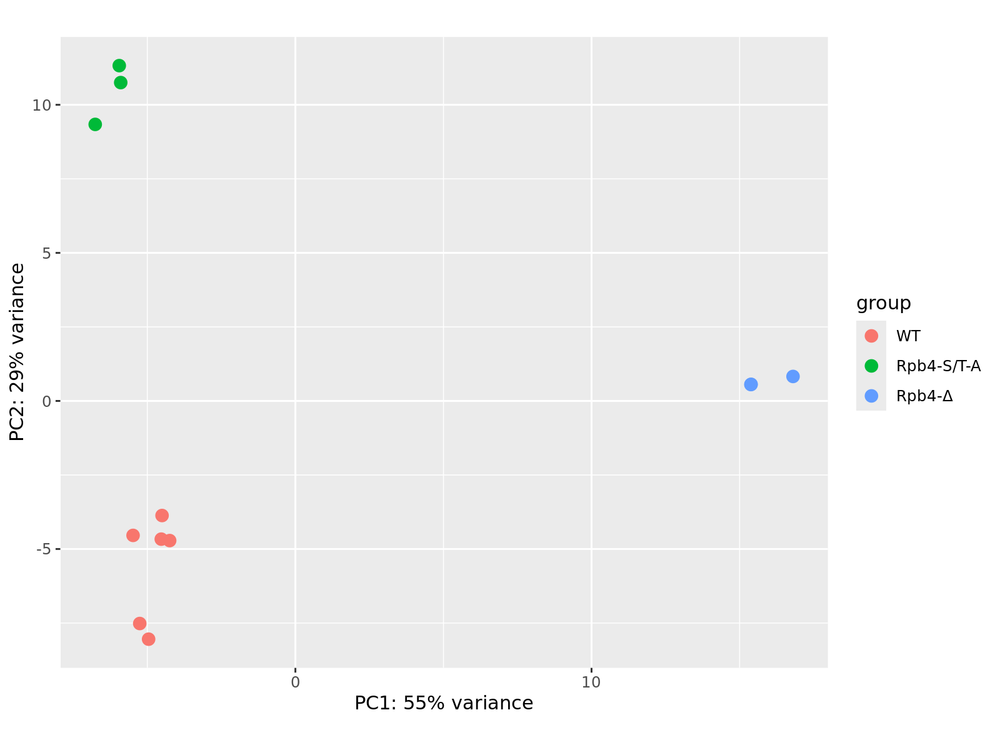
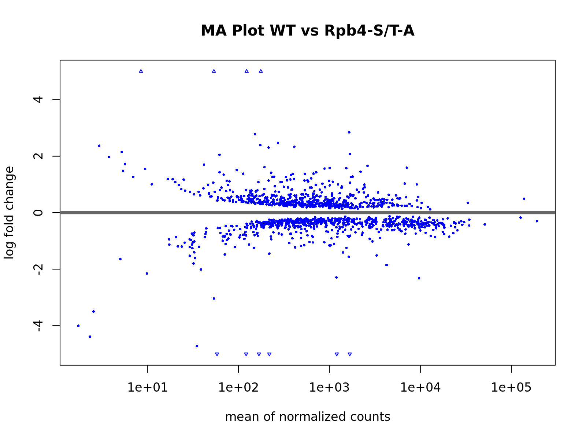
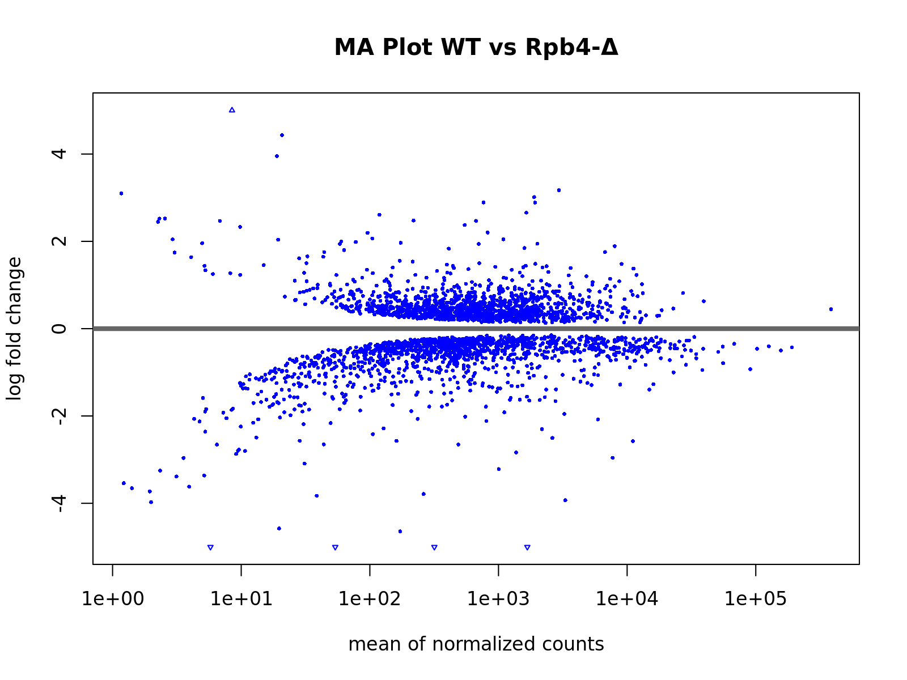
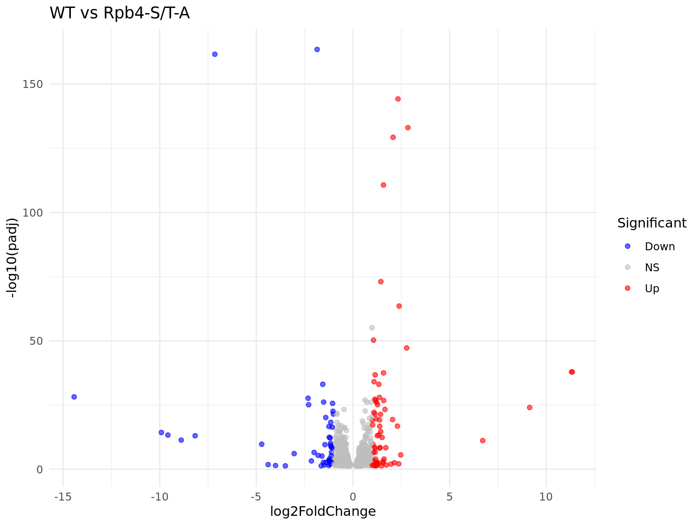
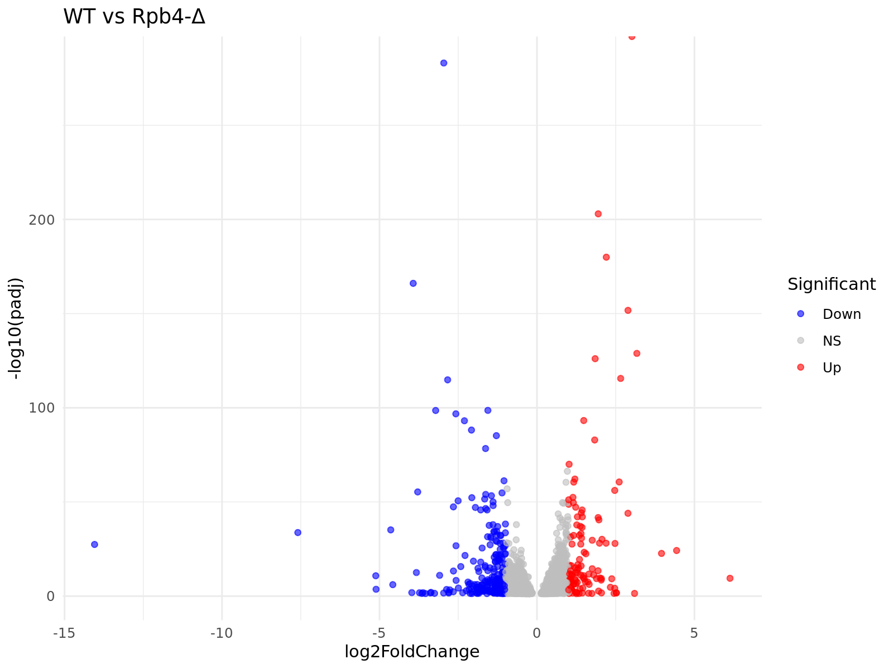
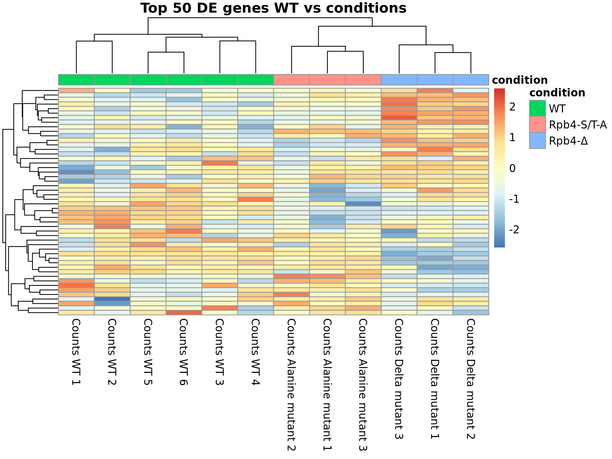
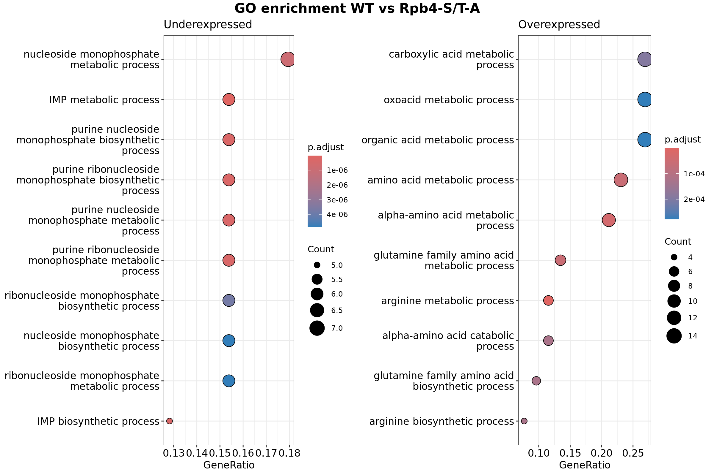
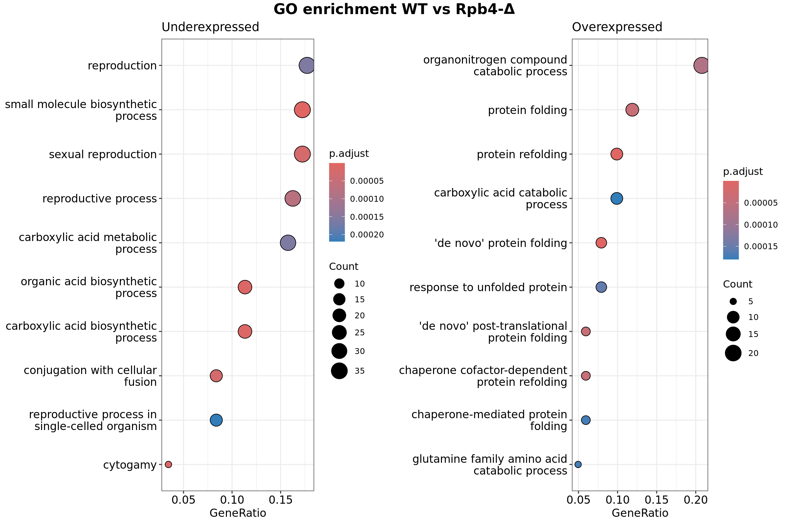

# RNA-seq Analysis Pipeline for Rpb4 Mutants in Saccharomyces cerevisiae

## Overview
<p align="justify">
This repository contains a complete RNA-seq analysis pipeline applied to Saccharomyces cerevisiae strains carrying mutations in the Rpb4 subunit of RNA polymerase II.

The analysis covers:
* Quality control of raw FASTQ files
* Read alignment and quantification
* Differential expression analysis
* Downstream statistical analysis and visualization
<br>


<br>
The objective of this project is to characterize transcriptional changes associated with phospho-null and phospho-mimetic mutations in the Rpb4 subunit.

## Repository structure

```text
├── run_pipeline.sh
├── environment.yml
├── bash/                  Shell modules for QC, trimming, alignment, counting
├── R/                     Statistical analysis scripts (DESeq2, enrichment, plots)
├── data/                  Processed data (dds, metadata, count matrix)
├── Plots/                 Figures generated by R modules
```

## Requirements

### Software Dependencies
- Conda/Mamba (>= 4.10)
- GNU Parallel
- Bash (>= 4.0)

### Hardware Requirements
- RAM: ≥ 16 GB (recommended 32 GB)
- CPU: ≥ 8 cores (recommended 10-16)
- Storage: ≥ 50 GB free space
- OS: Linux/macOS

### Quick Start

1. **Clone repository**
```bash
git clone https://github.com/AdilHannaoui/RNA-seq-Analysis
cd RNA-seq-Analysis
```

2. **Create environment**
```bash
# Using mamba (recommended)
mamba env create -f environment.yml

# Or using conda
conda env create -f environment.yml
```

3. **Download reference genome**
```bash
chmod +x download_genome.sh
bash download_genome.sh
```

4. **Build HISAT2 index**
```bash
conda activate rnaseq-rpb4
hisat2-build reference/Saccharomyces_cerevisiae.R64-1-1.dna.toplevel.fa reference/sc_hisat2_index
```

5. **Download Test data**
```bash
chmod +x download_test_data.sh
bash download_test_data.sh
```

6. **Run pipeline**
**Option 1 — Snakemake (recommended):**
```bash
snakemake --cores 8
```
Snakemake automatically detects samples, handles parallelisation and skips already completed steps.

**Option 2 — Bash (classic):**
```bash
bash run_pipeline.sh
```

## Installation and running the pipeline

All analyses are fully reproducible using the Conda environment defined in `environment.yml`.

### Run with Snakemake (recommended)
Snakemake automatically detects samples, handles parallelisation and skips 
already completed steps.
```bash
snakemake --cores 8
```

### Run with Bash (classic)
The `run_pipeline.sh` script orchestrates all steps in a single command.
```bash
bash run_pipeline.sh
```

Both options use the same Conda environment and produce identical results.

### Recommended: install ```mamba``` for faster environment creation
Creating environments that include R + Bioconductor can be slow with the default Conda solver. For a much faster and smoother installation, it is recommended to install mamba in the base environment

```conda install -n base mamba```

then create the environment using:

```
mamba env create -f environment.yml
```

If you prefer to use Conda:

```
conda env create -f environment.yml
```

Activate the environment

```
conda activate rnaseq-rpb4
```

Before running the pipeline, ensure execution permissions:

```
chmod +x run_pipeline.sh
chmod +x bash/*.sh
```

Run the full workflow with:

```
bash run_pipeline.sh
```

</p>


## Configuration files

The selected inputs can be found in the configuration files used for each of the pipeline modules. These can be found in the files ```bash/config.sh``` and ```R/config.R```. The modules themselves follow the following structure:

```text
├── bash/01-fastqc.sh
├── bash/02-trimming.sh
├── bash/03-alignment_hisat2.sh
├── bash/04-featurecounts.sh
├── R/01-load_counts.R
├── R/02-deseq2_analysis.R
├── R/03-enrichment_analysis.R
├── R/04-visualizations.R
```

## Inputs and Outputs

Inputs:
* FASTQ (test data included)
* FASTA (```ftp.ensembl.org/pub/release-112/fasta/saccharomyces_cerevisiae/dna/Saccharomyces_cerevisiae.R64-1-1.dna.toplevel.fa.gz```)
* GTF File (```ftp.ensembl.org/pub/release-112/gtf/saccharomyces_cerevisiae/Saccharomyces_cerevisiae.R64-1-1.112.gtf.gz```)
* configuration files (```R/config.R``` and ```bash/config.sh```)
* 
The HISAT2 index must be generated from the provided FASTA before running the alignment step. The Path is defined in ```bash/config.sh```

Outputs:
* QC reports (```bash/01-fastqc.sh```)
* trimmed FASTQ (```bash/02-trimming.sh```)
* BAM (```bash/03-alignment_hisat2.sh```)
* count matrix (```bash/04-featurecounts.sh```)
* DESeq2 tables (```R/02-deseq2_analysis.R```)
* enrichment analysis (```R/03-enrichment_analysis.R```)
* Figures (```R/04-visualizations.R```)

## Experimental design

- Organism: Saccharomyces cerevisiae
- Conditions:
  - WT (n = 6)
  - Rpb4-S/T-A (n = 3)
  - Rpb4-Δ (n = 3)
- Data type: RNA-seq (Single End)

Biological replicates were used for all conditions.

## Dataset
<p align="justify">
  
RNA-seq data were generated at the Institute of Functional Biology and Genomics (IBFG).
Due to data usage restrictions, test data can be downloaded using the provided ``` download_test_data.sh ``` script to allow testing of the pipeline’s functionality.

Gene-level count matrices and sample metadata are provided in this repository,
allowing full reproducibility of the downstream statistical analysis.
</p>


## Biological Context

### About Saccharomyces cerevisiae
<p align="justify">
Saccharomyces cerevisiae is a unicellular eukaryotic fungus widely used as a model organism in molecular biology, genetics, and biotechnology. Its main advantages include a short life cycle, easy and inexpensive cultivation, a fully sequenced genome, and an extensive collection of genetic tools (mutant libraries, ORF collections, tagging systems, and genome‑editing methods). These features enable high‑throughput experiments and mechanistic studies of cellular processes that are conserved in higher eukaryotes, such as transcription, RNA processing, translation, and stress responses.
</p>

### Rpb4-subunit Role
<p align="justify">
  
**Rpb4** is one of the key subunits of RNA polymerase II (Pol II) and plays an essential role in processes such as transcription complex recruitment, RNA elongation, and the coupling between nuclear and cytoplasmic events related to mRNA metabolism. Together with Rpb7, it forms a stable subcomplex that associates with Pol II and contributes both to its regulatory functions and to the structural integrity of the enzyme.

Recent studies have identified several phosphorylatable residues in Rpb4 —S125, S197, T134, T144, and T193— suggesting that phosphorylation may represent an important regulatory mechanism for its activity. Modification of these residues could influence Rpb4 function and, consequently, the overall performance and regulation of RNA polymerase II.
</p>

### Project Context
<p align="justify">
This project, carried out at the Institute of Functional Biology and Genomics (IBFG), aims to study and characterize the Rpb4 subunit of RNA polymerase II under different mutagenic conditions. To achieve this, two strains were generated through site‑directed mutagenesis, specifically designed to alter the phosphorylatable residues of the protein:

* Rpb4‑S/T‑A: the five phosphorylatable residues identified in Rpb4 are replaced with alanine, thereby eliminating any potential phosphorylation or regulatory interaction mediated by these sites.

* Rpb4‑Δ: subunit with a loss-of-function mutation in the 5 amino acids

The purpose of these constructs is to determine the functional role of these residues in Rpb4 activity and, consequently, in the proper performance of RNA polymerase II, assessing how phosphorylation (or its absence) influences key transcriptional processes.
</p>

## Methods
The pipeline includes preprocessing (FastQC v0.11.9, Trimmomatic v0.39), alignment (HISAT2 v2.2.1), quantification (featureCounts v2.0), and differential expression analysis (R v4.4.0).

### FastQC and Trimmomatic
<p align="justify">
Quality control of the FASTQ files was performed using FastQC, followed by a trimming process with Trimmomatic according to the following criteria:

* ILLUMINACLIP:2:30:10: Removal of Illumina adapter sequences.

* SLIDINGWINDOW:4:20: Quality-based trimming using a 4-base sliding window with an average Phred quality threshold of 20 (99% base-call accuracy).

* MINLEN:20: Length-based filtering to discard processed reads shorter than 20 bases. This threshold facilitates a broad exploratory analysis by prioritizing sensitivity in transcript detection.
</p>

### HISAT2 Alignment
Sequence alignment was performed using HISAT2, a splice-aware aligner specifically designed for RNA-seq analysis. Since the libraries were prepared using the Illumina TruSeq Stranded protocol, the resulting reads originate from the reverse strand. Consequently, the ```--rna-strandness R``` option was applied to account for the strandedness of the sequencing data.


### FeatureCounts
Finally, the featureCounts tool was utilized to generate a gene count matrix for all samples in this study. This step is critical for the subsequent differential expression analysis using DESeq2. The ```-S 2``` option was specified to remain consistent with the reverse-stranded protocol employed during sequencing. The resulting file was saved in the ```/data``` directory of this repository.


### DESeq2 analysis
Differential expression was assessed using the DESeq2 package. This allows us to compare gene expression across the experimental conditions included in this study.

## Results
### PCA
<p float="left">
  

<p align="justify">
The principal component analysis shows that PC1 (55%) primarily separates WT from rpb4Δ. rpb4Δ is clearly shifted relative to WT, indicating a broad and consistent transcriptomic change. rpb4‑S/T→A clusters closer to WT or occupies an intermediate position, suggesting a subtler or partial effect. Overall, loss of Rpb4 produces a larger global impact on the transcriptome than the S/T→A phospho‑null mutation.
</p>

### MA plot
<p float="left">
  
  
</p>

<p align="justify">
MA plots comparing WT to rpb4‑S/T→A and WT to rpb4Δ (mean normalized counts vs log2FC). rpb4Δ shows a larger number of differentially expressed genes and greater fold‑changes (|log2FC| ≥ 1 and padj < 0.05), whereas rpb4‑S/T→A exhibits fewer and smaller expression changes.
</p>

### Volcano plot
<p float="left">
  
  
</p>

<p align="justify">
Volcano plots (log2FC vs −log10(padj)) comparing WT to rpb4‑S/T→A and WT to rpb4Δ. rpb4Δ shows many more significant genes and larger fold‑changes (padj < 0.05 and |log2FC| ≥ 1), with a clear down‑regulation; rpb4‑S/T→A exhibits fewer and smaller expression changes.
</p>

### Heatmap
<p float="left">
  

<p align="justify">
Heatmap of the top 50 DE genes (Z‑score scaled); columns clustered by sample and rows by gene. rpb4Δ samples (blue) show a distinct expression signature compared to WT, while rpb4‑S/T→A samples are closer to WT.
</p>

### Enrichment Analysis
<p float="left">
  
  
</p>

<p align="justify">
The functional enrichment analysis, performed on differentially expressed genes meeting both padj < 0.05 and |log2FC| ≥ 1, and restricted to the biological process ontology (GO_ONTOLOGY = "BP") with p‑value < 0.05 and q‑value < 0.05, reveals distinct functional signatures for each mutant.
  
* Rpb4‑S/T‑A (phospho‑null)
  * Underexpressed processes: Nucleoside monophosphate and IMP biosynthesis; purine ribonucleotide metabolic pathways are specifically depleted.
  * Overexpressed processes: Carboxylic/oxoacid metabolism and amino‑acid metabolic and catabolic pathways (notably glutamine and arginine).
    
    The S/T→A phospho‑null mutation appears to impair nucleotide anabolism while shifting cellular metabolism toward amino‑acid and organic‑acid processing,           consistent with a metabolic reprogramming or compensatory response.

* Rpb4‑S/T‑D (loss-of-function)
  * Underexpressed processes: Reproduction and sexual/cell‑fusion related processes; small molecule and carboxylic acid biosynthesis are reduced.
  * Overexpressed processes: Protein folding, refolding, chaperone‑mediated folding and unfolded protein response; organonitrogen compound catabolism and              amino‑acid catabolic processes.

    Loss of Rpb4 triggers proteostatic stress and chaperone activation while impairing biosynthetic and reproductive programs, consistent with a broad                 loss‑of‑function phenotype that compromises cellular homeostasis.
</p>

## Conclusions
<p align="justify">
  
Integrated analysis of PCA, MA/volcano plots, heatmap and GO enrichment indicates that **Rpb4 deletion (rpb4Δ) causes a broad transcriptomic disruption**, characterized by numerous differentially expressed genes, predominant down‑regulation of biosynthetic and reproductive programs, and induction of proteostasis/chaperone responses. **The S/T→A phospho‑null mutant shows a subtler phenotype**, with down‑regulation of purine/ribonucleotide biosynthesis and a metabolic shift toward amino‑acid and organic‑acid pathways, suggesting a partial or pathway‑specific functional alteration. Validation experiments (qPCR, protein assays, metabolite measurements) are recommended to confirm these signatures.

</p>


## Limitations

* The raw RNA-seq sequence files used in this project cannot be uploaded to the repository, which may limit full reproducibility of the analyses. However, the count matrices, ```dds``` objects, and metadata are included in the ```output/real/``` folder, enabling complete reproducibility of all statistical analysis steps.

* Example/sample data are also provided to verify that the master pipeline runs correctly.

* Some input versions used in the analyses are outdated, which may give the impression of slightly outdated results.


## Changelog

### v1.0.0 — 2025-01-21
- Initial release of the RNA-seq pipeline
- Included count matrix, metadata and test data
